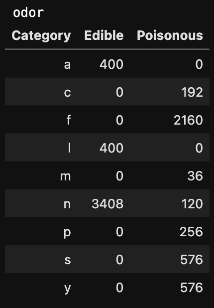
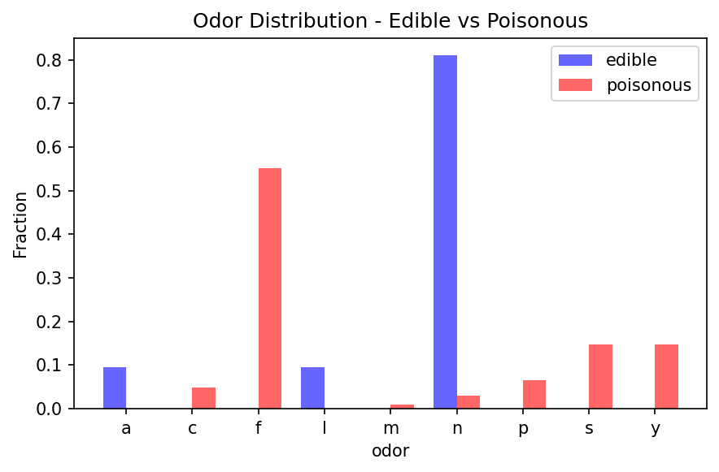
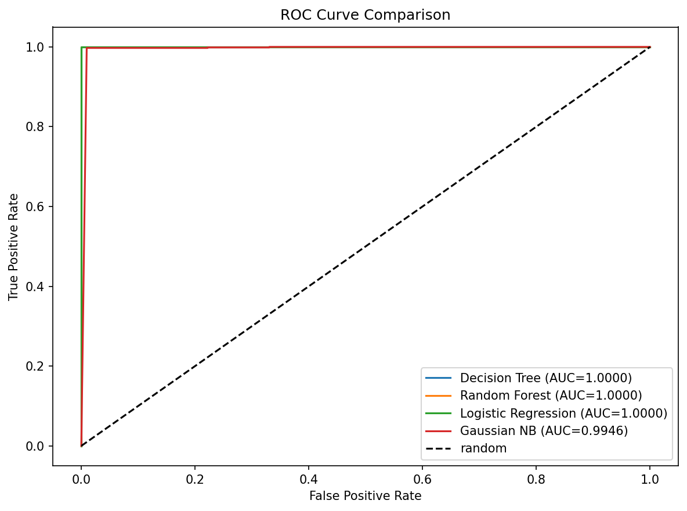

# Mushroom-Classification

This repository holds an attempt to apply classification algorithms to mushroom edibility prediction using data from the [UCI Mushroom Dataset](https://www.kaggle.com/datasets/uciml/mushroom-classification) Kaggle challenge.

## Overview
The task, as defined by the Kaggle challenge, is to use 23 categorical physical characteristics of mushrooms such as cap shape, odor, gill color, and habitat to classify each mushroom as either edible or poisonous. The approach in this repository formulates the problem as a binary classification task, comparing the performance of 4 classifiers: Decision Tree, Random Forest, Logistic Regression, and Gaussian Naive Bayes. Our best models (Decision Tree and Random Forest) achieved 100% accuracy on the test set, confirming that the physical features in this dataset provide perfect separation between edible and poisonous mushrooms.

## Summary of Workdone

### Data

- **Type:** Input: CSV file of 23 categorical features (letter-encoded), Output: binary class label (edible or poisonous)
- **Size:** 8,124 samples, 22 features + 1 target column
- **Split:** 6,499 samples for training, 1,625 for testing

### Preprocessing / Cleanup

- Dropped `veil-type` feature as it contained only one unique value across all 8,124 samples, making it completely uninformative for any ML model
- Replaced missing values in `stalk-root` (2,480 entries encoded as `?`) with the most frequent value (mode) as a simple imputation strategy
- Label encoded the target variable (edible=0, poisonous=1)
- One-hot encoded all 21 remaining categorical features, expanding the dataset from 21 columns to 115 binary columns
- Dataset was shuffled before splitting to ensure a representative train/test split

### Data Visualization

Feature distributions were compared between edible and poisonous classes using bar charts and count tables for all 22 features. Key findings:

- **odor** is the strongest separator with poisonous mushrooms concentrating in foul, creosote, and pungent odors while edible mushrooms are mostly odorless or almond/anise scented
- **spore-print-color**, **gill-color**, and **ring-type** also show strong class separation
- **bruises**, **stalk-surface-above-ring**, and **stalk-surface-below-ring** show moderate separation
- **gill-attachment** and **gill-spacing** show minimal differences between classes
- No numerical outliers exist as all features are categorical
- Class balance is close to even — 51.8% edible and 48.2% poisonous

**Odor Feature — Count Table:**



**Odor Feature — Distribution:**



### Problem Formulation

- **Input:** 115 binary columns from one-hot encoding of 21 categorical features
- **Output:** Binary class label (0=edible, 1=poisonous)
- **Models tried:**
    - **Decision Tree** — natural fit for categorical rule-based data, highly interpretable. A decision tree mirrors the kind of rule-based reasoning one might use to identify mushrooms in the wild
    - **Random Forest** — ensemble of decision trees, reduces risk of overfitting
    - **Logistic Regression** — simple linear baseline classifier
    - **Gaussian Naive Bayes** — probabilistic classifier, included as a lower baseline since it assumes Gaussian distributions which don't perfectly fit binary one-hot encoded features

### Training

- All models trained using scikit-learn on a standard MacBook
- Training was near-instant for all classifiers given the small dataset size (8,124 rows)
- No training curves are applicable as these are non-iterative sklearn classifiers — there are no loss vs epoch curves to report
- Data was shuffled before splitting to ensure a representative train/test split
- No significant difficulties were encountered during training

### Performance Comparison

Key metrics: Accuracy, F1 Score, and AUC on held-out test set (1,625 samples)

| Classifier | Accuracy | F1 Score | AUC |
|---|---|---|---|
| Decision Tree | 1.0000 | 1.0000 | 1.0000 |
| Random Forest | 1.0000 | 1.0000 | 1.0000 |
| Logistic Regression | 0.9994 | 0.9994 | 1.0000 |
| Gaussian NB | 0.9569 | 0.9568 | 0.9946 |

**ROC Curve Comparison:**



### Conclusions

- Decision Tree and Random Forest classifiers achieve perfect classification on this dataset, confirming that the physical features of mushrooms provide complete separation between edible and poisonous classes
- **odor** is the single most informative feature, providing near-perfect separation on its own
- Tree-based methods are the natural choice for this dataset given its categorical nature — decision trees mirror the kind of rule-based reasoning one might use to identify mushrooms in the wild
- Logistic Regression performs nearly as well despite assuming linear boundaries, suggesting the one-hot encoded features are largely linearly separable
- Gaussian Naive Bayes performs lowest as it incorrectly assumes Gaussian distributions for binary one-hot encoded features

### Future Work

- Investigate which single feature (likely odor) is sufficient for perfect classification on its own
- Explore feature importance scores from the Random Forest to formally rank the most predictive features
- Test on larger and noisier mushroom datasets to see if perfect classification holds
- Try training without one-hot encoding to see if tree-based methods can handle raw categorical features directly

## How to Reproduce Results

1. Clone this repository:
```bash
git clone https://github.com/jasemcada/Mushroom-Classification.git
```
2. Download the dataset from [Kaggle](https://www.kaggle.com/datasets/uciml/mushroom-classification) and place `mushrooms.csv` in the repository folder
3. Install the required packages (see Software Setup below)
4. Open `Kaggle_Project.ipynb` in Jupyter Notebook or JupyterLab
5. Run all cells from top to bottom

## Overview of Files in Repository

- `Kaggle_Project.ipynb`: Main project notebook containing all data loading, visualization, cleaning, and ML code
- `odor_distribution.png`: Bar chart comparing odor distribution between edible and poisonous mushrooms
- `odor_table.png`: Count table for odor feature broken down by class
- `roc_comparison.png`: ROC curve comparison across all 4 classifiers
- `README.md`: This file

## Software Setup

Required packages:
- pandas
- numpy
- matplotlib
- scikit-learn
- tabulate

Install all at once:
```bash
pip3 install pandas numpy matplotlib scikit-learn tabulate
```

### Training

To train the models:
1. Ensure you have completed all preprocessing steps in the notebook
2. Run the Machine Learning section of `Kaggle_Project.ipynb`
3. All 4 classifiers will be trained automatically using scikit-learn
4. Training is near-instant on a standard laptop given the small dataset size

### Performance Evaluation

To evaluate performance:
1. Run all cells in the Machine Learning section after training
2. A metrics table displaying Accuracy, F1 Score, and AUC will be generated for all 4 classifiers
3. ROC curves for all classifiers will be displayed and saved as `roc_comparison.png`

## Citations

- UCI Machine Learning Repository: Mushroom Data Set. Donated April 1987.
- Kaggle Dataset: [https://www.kaggle.com/datasets/uciml/mushroom-classification](https://www.kaggle.com/datasets/uciml/mushroom-classification)
- Scikit-learn: Machine Learning in Python, Pedregosa et al., JMLR 12, pp. 2825-2830, 2011.
